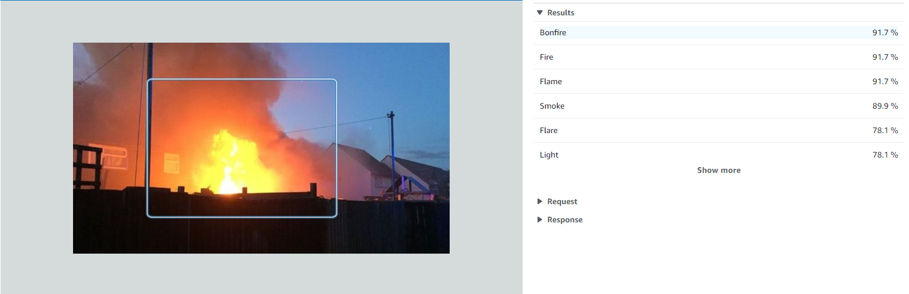

# AWS Rekognition for Fire Detection
AWS Demo on detection fire using aws rekognition service. 

# AWS Rekognition
Amazon Rekognition makes it easy to add image and video analysis to your applications using proven, highly scalable, deep learning technology that requires no machine learning expertise to use. With Amazon Rekognition, you can identify objects, people, text, scenes, and activities in images and videos, as well as detect any inappropriate content. Amazon Rekognition also provides highly accurate facial analysis and facial search capabilities that you can use to detect, analyze, and compare faces for a wide variety of user verification, people counting, and public safety use cases.

With Amazon Rekognition Custom Labels, you can identify the objects and scenes in images that are specific to your business needs. For example, you can build a model to classify specific machine parts on your assembly line or to detect unhealthy plants. Amazon Rekognition Custom Labels takes care of the heavy lifting of model development for you, so no machine learning experience is required. You simply need to supply images of objects or scenes you want to identify, and the service handles the rest.

# Get Started
Make sure you have an AWS account with its key and secret. insert those parameters on credential.py file:

# Run Predictions
1. Run runner_multi.py to perform detection on images. The process will make requests to client.rekognition API service and will return image with top labels. Then the process will filter labels related to fire.

2. Run results.py to generate confunsion matrix of the results.

